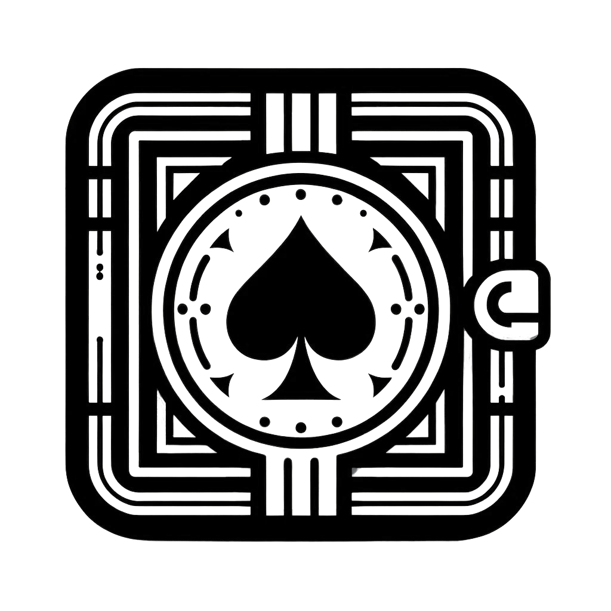

[![Stargazers][stars-badge]][stars-url]
[![Issues][issues-badge]][issues-url]
[![Ko-fi][kofi-badge]][kofi-url]

<!-- PROJECT LOGO -->
 

  

  <h3 align="center">The Poker Vault</h3>

  

    Capture Your Game, Elevate Your Strategy
     
    <a href="https://github.com/thepokervault/thepokervault"><strong>Explore the docs »</strong></a>
     
     
    <a href="https://github.com/thepokervault/thepokervault">View Demo</a>
    ·
    <a href="https://github.com/thepokervault/thepokervault/issues/new?labels=bug&template=bug-report---.md">Report Bug</a>
    ·
    <a href="https://github.com/thepokervault/thepokervault/issues/new?labels=enhancement&template=feature-request---.md">Request Feature</a>
  

<!-- TABLE OF CONTENTS -->

  
Table of Contents

  <ol>
    <li>
      <a href="#about-the-project">About The Project</a>
      <ul>
        <li><a href="#built-with">Built With</a></li>
      </ul>
    </li>
    <li>
      <a href="#getting-started">Getting Started</a>
      <ul>
        <li><a href="#prerequisites">Prerequisites</a></li>
        <li><a href="#installation">Installation</a></li>
      </ul>
    </li>
    <li><a href="#usage">Usage</a></li>
    <li><a href="#roadmap">Roadmap</a></li>
    <li><a href="#contributing">Contributing</a></li>
    <li><a href="#license">License</a></li>
    <li><a href="#contact">Contact</a></li>
  </ol>

<!-- ABOUT THE PROJECT -->
## About The Project

The Poker Vault is an app designed to help poker players study their live games anytime and improve their strategy by identifying their own weaknesses and those of their opponents.

### Features
- Record every move made in a poker match.
- Save and analyze data with custom notes for each stage of the game and opponents.
- Sync games to the cloud for review on any device (Pro users only).
- Pro users can subscribe monthly or receive a lifetime pro license with a minimum $5 donation.

(<a href="#readme-top">back to top</a>)

### Built With
* [Dart](https://dart.dev)
* [Firebase](https://firebase.google.com)
* [Hive for Dart](https://pub.dev/packages/hive)
* [NoSQL](https://www.mongodb.com/nosql-explained)

Additional tools:
* [Shared Preferences](https://pub.dev/packages/shared_preferences)
* [Provider](https://pub.dev/packages/provider)

(<a href="#readme-top">back to top</a>)

<!-- GETTING STARTED -->
## Getting Started

To get a local copy up and running, follow these simple steps.

### Prerequisites

You need an Android phone and internet access.

### Installation

1. Download the APK.
2. Give permission to install from unknown sources on your phone.
3. Install the app and start using it.

(<a href="#readme-top">back to top</a>)

<!-- USAGE EXAMPLES -->
## Usage

Use the app to record every move in your poker matches, analyze your game later, and take custom notes on each stage of the game and your opponents.

_For more examples, please refer to the [Documentation](https://example.com)_

(<a href="#readme-top">back to top</a>)

<!-- ROADMAP -->
## Roadmap

- [x] Add Changelog
- [x] Add back to top links
- [ ] Add Additional Templates w/ Examples
- [ ] Add "components" document to easily copy & paste sections of the readme
- [ ] Multi-language Support
    - [ ] Chinese
    - [ ] Spanish

See the [open issues](https://github.com/thepokervault/thepokervault/issues) for a full list of proposed features (and known issues).

(<a href="#readme-top">back to top</a>)

<!-- CONTRIBUTING -->
## Contributing

Contributions to The Poker Vault can be made through donations. A minimum donation of $5 will grant you a lifetime pro license and a voice in the app's future features.

[![Ko-fi][kofi-badge]][kofi-url]

(<a href="#readme-top">back to top</a>)

<!-- LICENSE -->
## License

Distributed under a private license. No copying, modifying, reverse engineering, or commercial use allowed.

(<a href="#readme-top">back to top</a>)

<!-- CONTACT -->
## Contact

The Poker Vault - [@thepokervault_app](https://twitter.com/thepokervault_app) - [@willman_rds](https://twitter.com/willman_rds) - contact@thepokervault.app

Project Link: [https://github.com/thepokervault/thepokervault](https://github.com/thepokervault/thepokervault)

Donations: [Ko-fi](https://ko-fi.com/cattobaby)

(<a href="#readme-top">back to top</a>)

<!-- MARKDOWN LINKS & IMAGES -->
<!-- https://www.markdownguide.org/basic-syntax/#reference-style-links -->

[stars-badge]: https://img.shields.io/github/stars/thepokervault/thepokervault.svg?style=for-the-badge
[stars-url]: https://github.com/thepokervault/thepokervault/stargazers
[issues-badge]: https://img.shields.io/github/issues/thepokervault/thepokervault.svg?style=for-the-badge
[issues-url]: https://github.com/thepokervault/thepokervault/issues
[kofi-badge]: https://shields.io/badge/kofi-Buy_a_coffee-ff5f5f?logo=ko-fi&style=for-the-badgeKofi
[kofi-url]: https://ko-fi.com/cattobaby
[product-screenshot]: images/screenshot.png
